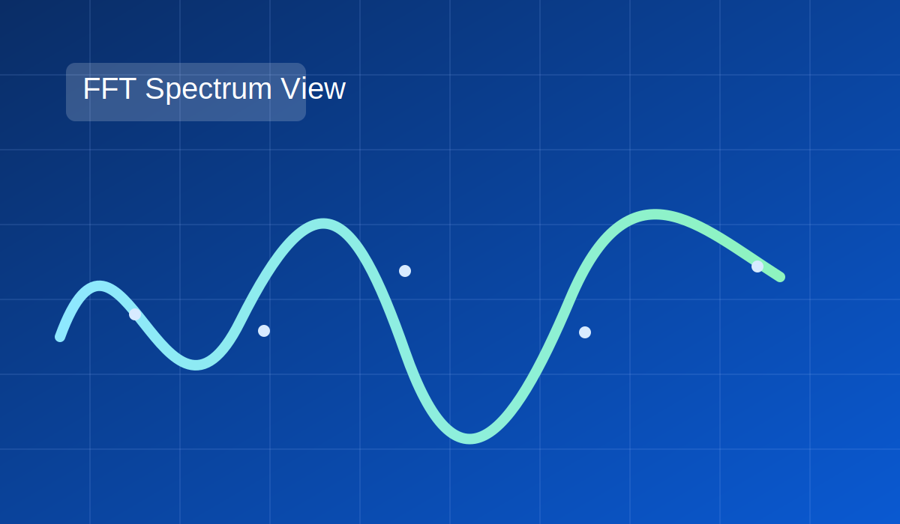

# Electron Microscope Support Center

Official support page for the Electron Microscope macOS application.

## Contact Support
- Email: **dbeyzade@hotmail.com**
- GitHub Issues: https://github.com/dbeyzade/electron-microscope-support/issues

## What We Support
- Installation and startup troubleshooting
- Hex, Binary, and Decimal data parsing
- FFT, edge detection, histogram equalization, and particle analysis output review
- App configuration and release guidance

## Recommended First Message Template
When contacting support, include:
1. macOS version
2. App build/version
3. Short issue summary
4. Steps to reproduce
5. Sample input format (if possible)

## Data Format Examples
- Hex: `0A 1F 2B 3C`
- Binary: `00001010 00011111`
- Decimal: `10 31 43 60`

## Visual Highlights
### FFT Spectrum

### Particle Mapping

### Support Workflow

## Privacy Note
Electron Microscope processes data locally on your Mac in normal operation.

## Response Policy
Typical first response time is within **1-2 business days**.

---
Last updated: March 25, 2026 (Build v4)
